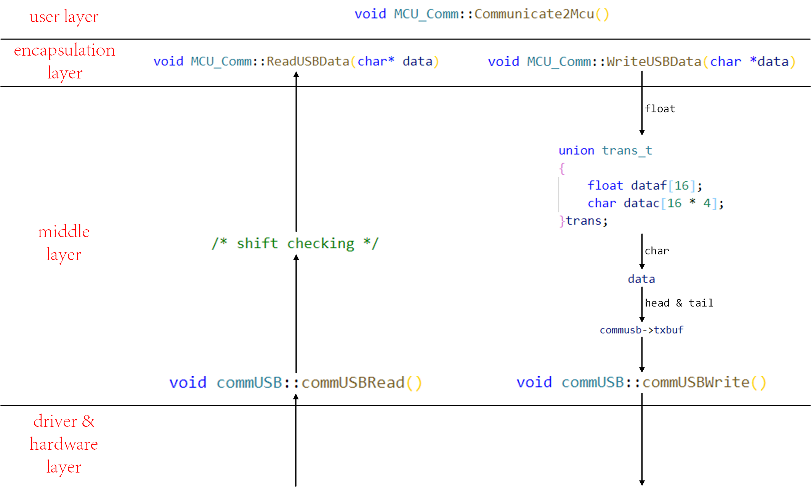

# communication scheme based on USB HID    
* This project gives an example, which can be modified by users.      
* Every block during `option start` and `option end` should be modified by users according to the actual situation, where contains necessary parameters, printing options and specific communication frame content.
* Provide simple shift checking function.    
* Need to pre install dependency `hidapi`, which address is:    
 [https://github.com/signal11/hidapi](https://github.com/signal11/hidapi)
* Overall workflow is as the follow figure:      

  

